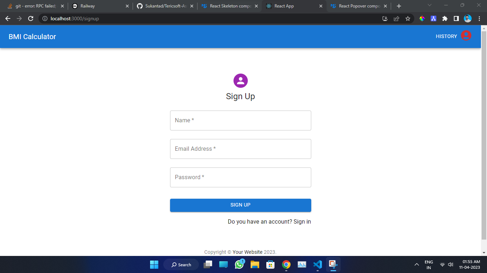
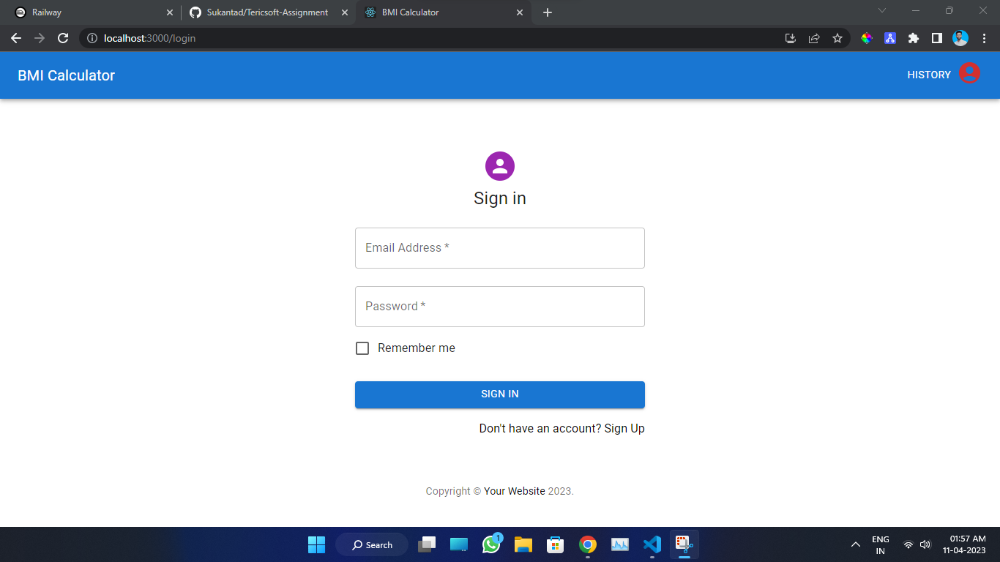
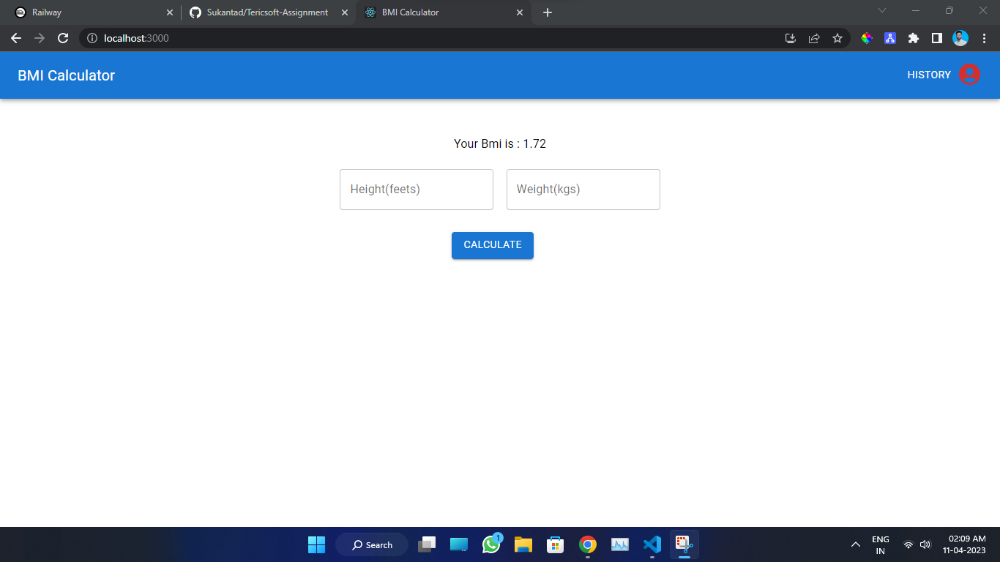
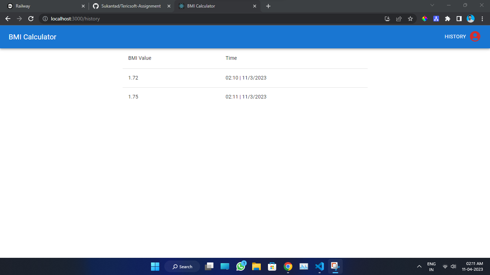
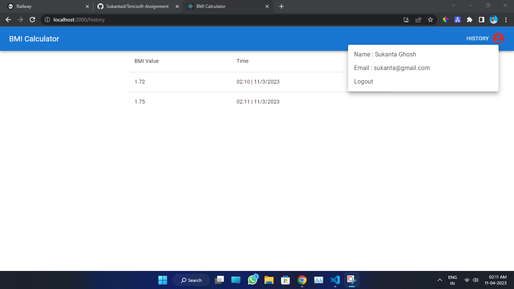

# BMI Calculator

### Body Mass Index , in this website user can measure their bmi using height and weight

- If any user want to use this website they have to create their account and they can check their history of bmi as well

### Live link -https://bmi-calculator-sukantad.vercel.app/

### Backend deployed link - https://tericsoft-assignment-production.up.railway.app/

## Features

- Login & Signup (JWT & And hashing the password)
- BMI Calculator
- History Check
- Profile details view
- Logout

## Tech Stack

- React
- MUI
- Node.js
- Express
- MongoDB

 ## How to run in locally 
 - first clone this repo 
 - install npm packages 
 - npm start 
 
## Here are some sample screen shoot

## Singup Page

 
  
  ## Login Page
 

## Home page

 
  
  ## History of BMI
 
  
  ## Profile and logout 
 

### Thank You
